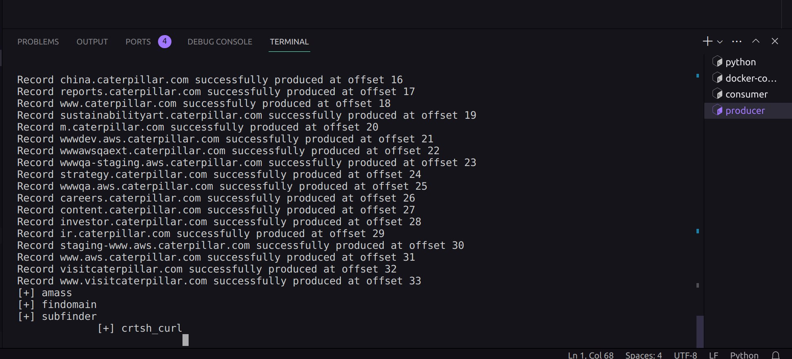
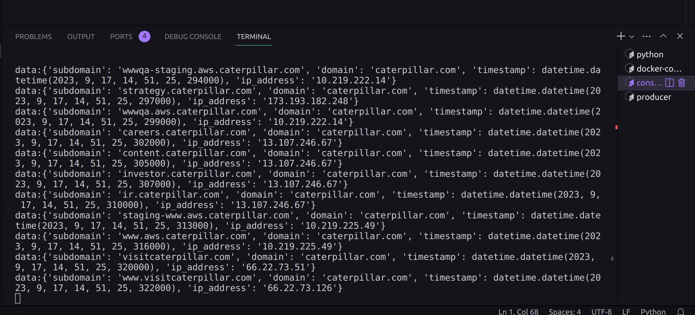
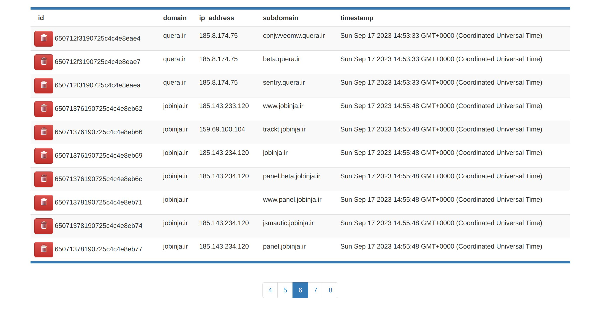
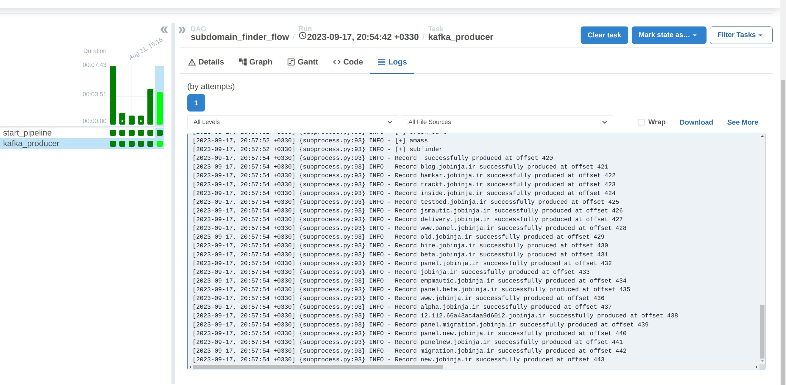

<!-- Improved compatibility of back to top link: See: https://github.com/othneildrew/Best-README-Template/pull/73 -->
<a name="readme-top"></a>
<!--
*** Thanks for checking out the Best-README-Template. If you have a suggestion
*** that would make this better, please fork the repo and create a pull request
*** or simply open an issue with the tag "enhancement".
*** Don't forget to give the project a star!
*** Thanks again! Now go create something AMAZING! :D
-->


<!-- PROJECT SHIELDS -->
<!--
*** I'm using markdown "reference style" links for readability.
*** Reference links are enclosed in brackets [ ] instead of parentheses ( ).
*** See the bottom of this document for the declaration of the reference variables
*** for contributors-url, forks-url, etc. This is an optional, concise syntax you may use.
*** https://www.markdownguide.org/basic-syntax/#reference-style-links
-->
[![MIT License][license-shield]][license-url]


<!-- PROJECT LOGO -->
<br />
<div align="center">
  <a href="[https://github.com/AmirAflak/WatchDog">
    
  </a>

  <h3 align="center">WatchDog</h3>

  <p align="center">
    powerful ETL subdomain tracking pipeline
   </p>
</div>


<!-- ABOUT THE PROJECT -->
## About The Project
Watchdog is a powerful ETL pipeline designed to track subdomains of specified domains in real-time. The goal of this project is to identify new subdomains as soon as they are discovered and alert the user immediately. This is achieved through efficient subdomain generation using multiprocessing, seamless and reliable data streaming with Kafka, flexible and scalable management of subdomains with MongoDB, advanced subdomain processing with PySpark, and effective workflow management and task coordination with Airflow. With the addition of the Telegram Notification feature, Watchdog provides real-time alerts and quick response to potential security threats. This project is ideal for security professionals, system administrators, and anyone who needs to monitor subdomains of specified domains in real-time.

### Features
* <b>Efficient Subdomain Generation:</b> Watchdog leverages multiprocessing to generate subdomains quickly and accurately, optimizing performance.
* <b>Real-time Streaming:</b> The pipeline integrates Kafka to provide seamless and reliable data streaming, ensuring up-to-date information.
* <b>Scalable Storage:</b> Watchdog utilizes MongoDB as its storage solution, enabling flexible and scalable management of subdomains.
* <b>Advanced Subdomain Processing and Security Scanning:</b> With the power of PySpark, Watchdog efficiently processes and analyzes subdomains, allowing for sophisticated data manipulation.Watchdog also offers a powerful subdomain scanning capability, This feature also allows for a more comprehensive understanding of the subdomains and their associated IP addresses, which can be useful for identifying potential security threats.
* <b>Robust Orchestration:</b> Watchdog employs Airflow for effective workflow management and task coordination, ensuring smooth execution.
* <b>Telegram Notification:</b> Watchdog supports sending notifications to a Telegram channel or group when a new subdomain is found. This feature allows for real-time alerts and quick response to potential security threats.

### Built With
* [Apache Airflow](https://airflow.apache.org/) - Workflow management and task scheduling.
* [Apache Spark](https://spark.apache.org/) - Fast and distributed data processing.
* [Apache Kafka](https://kafka.apache.org/) - Distributed streaming platform.
* [MongoDB](https://www.mongodb.com/) - Scalable NoSQL database.
  

<p align="right">(<a href="#readme-top">back to top</a>)</p>

<!-- USAGE EXAMPLES -->
### Screenshots
* <b>Kafka producer:</b> sends subdomains to the specified Kafka topic.<br />
  <a href="[https://github.com/AmirAflak/WatchDog">
    
  </a>
* <b>Kafka consumer:</b> Spark Streaming consumer to consume subdomains and store them in MongoDB.<br />
  <a href="[https://github.com/AmirAflak/WatchDog">
    
  </a>
* <b>MongoDB:</b> Checking the MongoDB collection snapshot to see the subdomains that have been tracked.<br />
  <a href="[https://github.com/AmirAflak/WatchDog">
    
  </a>
* <b>Airflow:</b> The Airflow DAG logs show the status and progress of the ETL pipeline.<br />
  <a href="[https://github.com/AmirAflak/WatchDog">
    
  </a>

<p align="right">(<a href="#readme-top">back to top</a>)</p>


<!-- GETTING STARTED -->
## Getting Started

This is an example of how you may give instructions on setting up your WatchDog locally.
To get a local copy up and running follow these simple example steps.

### Prerequisites
Before you can use this project, you'll need to have the following installed on your machine:
* Python above 3.10
* Docker
* Docker Compose
* Airflow

If you don't have these installed, you can follow the installation instructions for each tool:
* [Install Docker](https://docs.docker.com/get-docker/)
* [Install Docker Compose](https://docs.docker.com/compose/install/)
* [Install Airflow](https://airflow.apache.org/docs/apache-airflow/stable/installation/index.html)

Once you have these tools installed, you'll be ready to use this project.

### Installation & Usage

1. Clone the repo
   ```sh
   git clone https://github.com/AmirAflak/WatchDog.git
   ```
2. Navigate to the project directory:
   ```sh
   cd WatchDog/
   ```
3. Set targets in configs.py:
   ```py
   TARGETS=['caterpillar.com', 'url.com']
   ```
4. Install the required packages:
   ```sh
   make install
   ``` 
5. Initialize Docker Compose:
   ```sh
   make docker
   ```
6. Initialize the Spark streaming consumer:
   ```sh
   make consumer
   ```
7. Initialize the Airflow scheduler:
   ```sh
   make scheduler
   ```
8. Initialize the Airflow webserver GUI:
   ```sh
   make webserver
   ```
9. To stop the Docker Compose containers, run:
   ```sh
   make stop
   ```
That's it! You should now be able to use the project.


<p align="right">(<a href="#readme-top">back to top</a>)</p>


<!-- CONTRIBUTING -->
## Contributing

Contributions are what make the open source community such an amazing place to learn, inspire, and create. Any contributions you make are **greatly appreciated**.

If you have a suggestion that would make this better, please fork the repo and create a pull request. You can also simply open an issue with the tag "enhancement".
Don't forget to give the project a star! Thanks again!

1. Fork the Project
2. Create your Feature Branch (`git checkout -b feature/AmazingFeature`)
3. Commit your Changes (`git commit -m 'Add some AmazingFeature'`)
4. Push to the Branch (`git push origin feature/AmazingFeature`)
5. Open a Pull Request

<p align="right">(<a href="#readme-top">back to top</a>)</p>


<!-- LICENSE -->
## License

Distributed under the MIT License. See `LICENSE.txt` for more information.


<!-- MARKDOWN LINKS & IMAGES -->
<!-- https://www.markdownguide.org/basic-syntax/#reference-style-links -->
[license-shield]: https://img.shields.io/github/license/othneildrew/Best-README-Template.svg?style=for-the-badge
[license-url]: https://github.com/AmirAflak/WatchDog/blob/main/LICENSE
